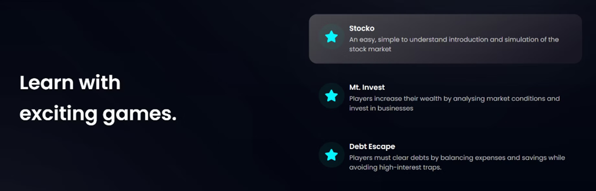
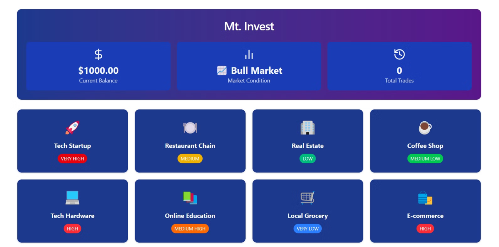
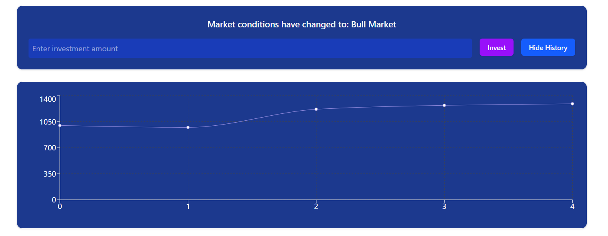

<h1 align="center">
  <a href="https://github.com/CommunityOfCoders/Inheritance-2024">
    
  </a>
  <br>
 FinZ
</h1>

<div align="center">
   A financial education website 
</div>
<hr>

<details>
<summary>Table of Contents</summary>

- [Description](#description)
- [Links](#links)
- [Tech Stack](#tech-stack)
- [Progress](#progress)
- [Future Scope](#future-scope)
- [Applications](#applications)
- [Project Setup](#project-setup)
- [Usage](#usage)
- [Team Members](#team-members)
- [Mentors](#mentors)
- [Screenshots](#screenshots)

</details>

## 📝Description


## 🔗Links

- [GitHub Repository](https://github.com/)
- [Demo Video]()
- [Drive Link to Screenshots of your project]()
- [Hosted Website Link]()
- [Hosted Backend Link]()


## 🤖Tech-Stack

Mention all languages/libraries/frameworks used in your project **domain-wise**   
You can use icons too - find them [here](https://github.com/get-icon/geticon) 

#### Front-end
- HTML
- Tailwind CSS
- JavaScript
- React


#### Back-end
- NodeJS
- ExpressJS


#### Database
- MongoDB


## 📈Progress

List down all the fully implemented features in your project
UI/UX of landing page
Mt. Invest


List down all the partially implemented features in your project
Stocko (Stock market simulation)
Backend servers

## 🔮Future Scope
Integration of AI and ML
Multiplayer games
Develop a community where users can interact with each other


## 💸Applications


## 🛠Project Setup

For the Web-App 1.Clone the GitHub repo.
```bash
git clone <url>
```
2.Enter the client directory. Install all the required dependencies.
```bash
  cd frontend
  npm install
  npm start
```

3.To start the backend server:4
```bash
  cd backend
  npm install
  npm start
```

## 👨‍💻Team Members

Add names of your team members with their emails and links to their GitHub accounts

- [Aditya Chavan ](https://github.com/adchad90)
- [Shrivara Bhat ](https://github.com/SOULShri)
- [Harish Adsul ](https://github.com/adsulharish)
- [Aadit Narke ](https://github.com/1thirty-five)

## 👨‍🏫Mentors

Add names of your mentors with their emails and links to their GitHub accounts

- [Krish Porwal ]():
- [Aniket ]():

## 📱Screenshots






